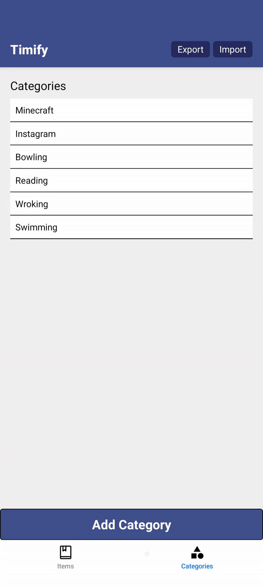

# ⏱️ Time Tracker App

A simple and intuitive time tracking app that helps you log, review, and analyze how you spend your time.
---

## 🎬 Preview



## 📌 Purpose
This app is built to help you better understand and manage your time. It provides the following features:

- **Track Time by Category**  
  - Create your own categories (e.g., Work, Study, Exercise)  
  - Log time entries with hours, minutes, and date  
  - Edit or delete entries and categories  

- **Monthly Overview**  
  - View a list of all entries for the current month  
  - See how much time you've spent on each category  

- **Statistics Dashboard**  
  - Visual charts showing time distribution across categories  
  - Easily understand your time investment trends  

- **CSV Import/Export**  
  - Export your logs to a `.csv` file  
  - Import from `.csv` for backup or migration  


## 📦 How to Build the APK
This app uses **Expo Application Services (EAS)** for building APK files.

### 🛠 Prerequisites

Make sure you have:

- Node.js installed
- Expo CLI installed globally:
  ```bash
  npm install -g expo-cli
  npx expo login
  eas build --platform android --profile preview
## 📚 What I Learned
1. SQLiteProvider has to be at the top layout level to provide access to all the Screens.
 Otherwise during navigation.back() between pages with individual SQLiteProvider the DB would be closed. 
2. useFocusEffect() executes when you navigate to the screen, or come back to the screen. It DOESN'T run on re-render. Use with useCallback() because, if the anon function you pass to the useFocusEffect() is created on every re-render, it triggers useFocusEffect again, causing an infinite loop.
3. useCallback() is used in conjunction with useFocusEffect(). If we just pass our anon function to useFocusEffect(), on each re-render the function 
reference will change. If we useCallback() the function is memoizated. It DOESN'T affect the function execution, only memoization. 
4. If we use useState.setItems() without useFocusEffect(), it triggers the re-render, executes Main, executes setItems -> setItems calls re-render -> infinite loop.
5. useEffect() runs on every re-render after the component is mounted. If you pass [] as a 2nd arg, it runs only on 1 render.
6. By using Stack.Screen in the components I can dynamically change the headers by adding functionality like handleDelete() in editItem.tsx.
    - However, headerRight accepts onPressIn, not onPress. 
7. useFocusEffect() is executed after useEffect() during React Navigation Lifecycle.

## 💬 Feedback
If you have any suggestions, feedback, or constructive criticism — I’d love to hear it!
Your insights will help me improve both this app and my skills as a developer.

Feel free to open an issue or reach out!
